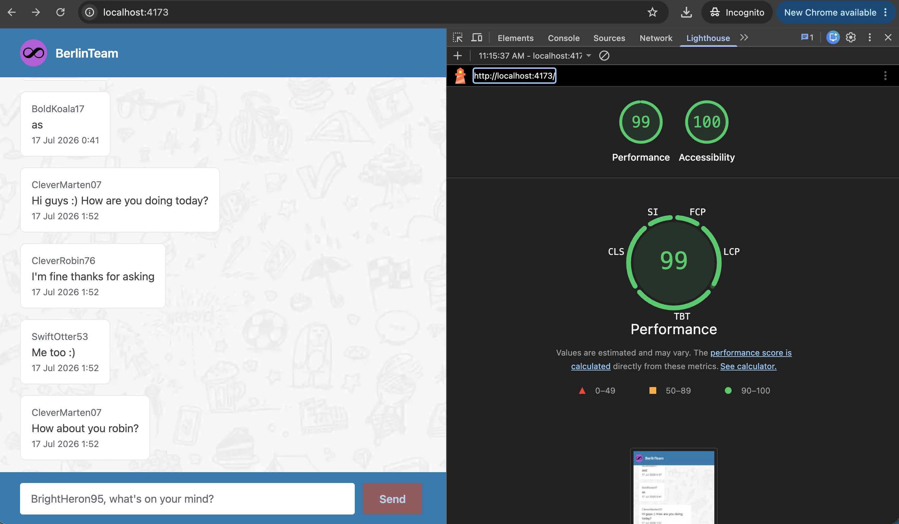

# Doodle Chat


A chat frontend for the Doodle frontend challenge, goal is to send and display messages
from all senders.

## Stack

- **Vite + React + TypeScript**
- **TanStack Query**
- **CSS Modules**

## How it works

The app is a thin UI over a TanStack Query cache entry holding the message list.
Hooks own all data logic and components only render what's in the cache.

### Data flow

1. **Identity** — on first visit a friendly author name is generated i.e "CleverOtter32" and
   persisted in `localStorage`. It determines which messages are "mine" vs "others" in the chat group
   ([useAuthor](src/hooks/useAuthor.ts)).
2. **Live Updates** — the API is polled every 3s to simulate WebSocket like bidirectional updates.
   We use `createdAt` as a cursor, so only newer messages are fetched and appended to the cache ([useMessages](src/hooks/useMessages.ts)).
3. **Optimistic Updates** - When user sends a message, it puts an optimistic _pending_ message into the same
   cache, then reconciles it with the server copy on success, or marks it _failed_ with a retry action on error ([useSendMessage](src/hooks/useSendMessage.ts)).

### UI/UX

- [MessageList](src/components/MessageList.tsx) virtualizes rows with
  `@tanstack/react-virtual`, Scrolls to the bottom as new messages arrive if within a certain distance from the bottom, and
  shows a "New messages ↓" button when you are above the threshold distance from the bottom
  ([useMessageListScroll](src/hooks/useMessageListScroll.ts)).
- [Message](src/components/Message.tsx) styles each bubble by "mine" or "others" and uses a subtle animation to indicate
  send status (pending / failed + retry).
- [ChatInput](src/components/ChatInput.tsx) submits on Enter and is keyboard-navigable with a visible focus indicator.
- Styling is done using CSS Modules over shared design tokens system
  ([design-system.css](src/design-system.css)). The UI is keyboard-navigable
  with visible focus indicators and WCAG-conformant contrast ratios.

### Performance & Accessibility

Lighthouse (mobile) on the production build (`npm run build && npm run preview`):
**99 Performance / 100 Accessibility**.



### Testing

Vitest + Testing Library, with the API mocked via MSW: `npm run test:run`.

A pre-commit hook ([.githooks/pre-commit](.githooks/pre-commit), installed by
`npm install` via the `prepare` script) runs lint, type check, and the test
suite with coverage, then refreshes the coverage badge above on every commit
(`npm run test:coverage` to run it manually).

## Next steps

- **Paginate older history** — the initial load currently fetches the whole message list. Bound it
  with `limit` and lazily fetch older pages with the `before` cursor as the user scrolls up (both
  already supported by [getMessages](src/api/messages.ts)).
  
  Loading the whole chat history means every visit downloads messages the user may never scroll to, and
  that cost grows with the conversation. Pagination fetches only the latest messages up front and loads
  older messages on demand, so initial load stays fast however long the chat gets.

## Setup

The BE for [chat API](https://github.com/DoodleScheduling/frontend-challenge-chat-api)
must be running locally first.

```sh
cp .env.example .env   # API base URL + bearer token
npm install
npm run dev
```
